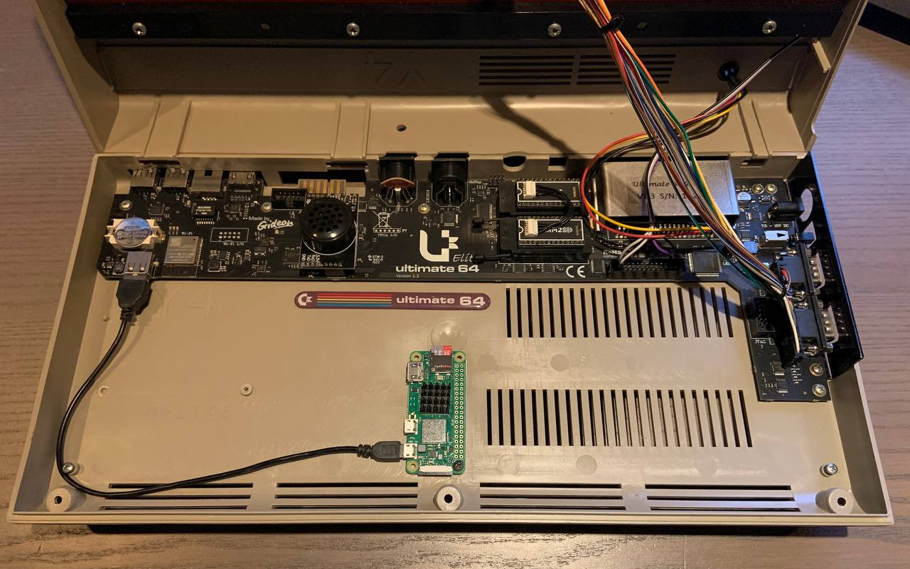

# DevOps64

Turning an Ultimate64 into a multi-platform DevOps machine.

---

# Hardware
*   Stock hardware:
    *   [Commodore 64](https://en.wikipedia.org/wiki/Commodore_64)
    *   1541 Ultimate2 or [1541 Ultimate 2+ cartridge](https://ultimate64.com/Main_products) cartridge, sporting firmware 3.x
    *   USB2LAN adapter, based on the ASIX AX88772/-A/-B chip 
*   [FPGA](https://en.wikipedia.org/wiki/Field-programmable_gate_array) implementation of the C64:
    *   [Ultimate64](https://ultimate64.com/Ultimate64)
*   [Pi Zero 2 W](https://www.raspberrypi.com/products/raspberry-pi-zero-2-w/)
*   [USB cable, USB-A to Micro-B](https://en.wikipedia.org/wiki/USB)
*   [Micro SD card, minimal 4GB](https://www.raspberrypi.com/documentation/computers/getting-started.html#sd-cards)

*   Optional: [Waveshare 2.13" e-Paper Hat](https://www.waveshare.com/2.13inch-e-paper-hat-b.htm)



---

# Software

*   [Raspbian PI OS Lite](https://www.raspberrypi.com/software/)
*   [GitHub repository](https://docs.github.com/en/repositories)
*   [GitHub - self hosted runner](https://docs.github.com/en/actions/hosting-your-own-runners)
*   [GitHub Desktop](https://desktop.github.com/)
*   [KickAssembler](http://www.theweb.dk/KickAssembler)
*   [1541 Ultimate II Remote Tool](https://github.com/markusC64/1541ultimate2/tree/tools)
*   [Visual Studio Code](https://code.visualstudio.com/)

---

# Installing Raspberry Pi OS using the Raspberry PI Imager

You can either use the 32-bit version or the 64-bit version of the Raspberry PI OS Lite. For the sake of the 64 theme I used the 64-bit version, which may not be the most efficiënt option.

The most convenient way of writing the RPi OS to a SD card is by using the [Raspberry Pi Imager](https://www.raspberrypi.com/software/).

While pressing  ```Ctrl+Shift+X``` the ```Advanced options```-menu appears. This allows you to configure the settings before writing the image to a SD card.

---

## Configure manually

Alternatively, you can also write some files to the OS manually after you have written the stock image to the SD card.

---

### Confuguring WiFi 

Add your ```wpa_supplicant.conf``` file to the ```boot``` partition of the already written 

Open a plaintext editor such as Notepad (Windows) or TextEdit (Mac) and create a new file. Add the following to the file for Raspberry Pi OS, Raspbian Stretch, or Raspbian Buster:

    country=US # Your 2-digit country code
    ctrl_interface=DIR=/var/run/wpa_supplicant GROUP=netdev
    network={
        ssid="YOUR_NETWORK_NAME"
        psk="YOUR_PASSWORD"
        key_mgmt=WPA-PSK
    }

If you're using Raspbian Jessie or older, use this instead:

    network={
        ssid="YOUR_NETWORK_NAME"
        psk="YOUR_PASSWORD"
        key_mgmt=WPA-PSK
    }

Finally, save the file. If you're using TextEdit on Mac, you'll need to go to ```Format > Make Plain Text``` in the menu bar before saving. Make sure the filename is exactly ```wpa_supplicant.conf```.

---

### Enabling SSH

Place an empty file named ```ssh``` in the ```boot``` partition of the SD card.

---

## Configuring the self-hosted runner on Raspberry Pi Zero 2 W

Insert the SD card into the Raspberry Pi and power the Pi up.

Log on using a SSH client and execute the following commands to upgrade the freshly installed image

    sudo apt update && sudo apt --yes full-upgrade

---

## Install the GitHub Runner

To install a `GitHub self-hosted runner` you need to follow the [docs on Github](https://docs.github.com/en/actions/hosting-your-own-runners/adding-self-hosted-runners). When running a 64-bit OS, make sure that you choose the ARM64 runner. 

The default values can be set by pressing ```enter``` a few times.

*Please note*: The single-core [Raspberry Pi Zero](https://www.raspberrypi.com/products/raspberry-pi-zero/) renders a [`6312 Segmentation fault`](https://github.com/actions/runner/issues/688) error while running `config.sh` as the ARMv6 CPU isn't supported for the .NET components. 

---

## Install the runner as a service

To install the runner as a service you need to give the ```install``` parameter to the ```svc.sh``` command

    sudo ./svc.sh install 

Starting the service is easy

    sudo ./svc.sh start

For more information on the service, see; [Configuring the self-hosted runner application as a service](https://docs.github.com/en/actions/hosting-your-own-runners/configuring-the-self-hosted-runner-application-as-a-service)

---

## Start the CI workflow

When starting the CI workflow for the first time the workflow installs the software prerequisites. These files are installed and cached on the SD card for future usage.

---

## Mounting inside the Commodore 64 casing

Combining and mounting the Raspberry Pi Zero W next to the Ultimate 64 into the Commodore 64 casing has a few benefits;

*   The RPi is only powered on when the Ultimate64 is powered on.
*   Everything inside the Commodore 64 case.

---

## Configuring your environment

The ```source/variables.env``` file contains all the variables you need to have a successful workflow run and targetting your Ultimate device.
